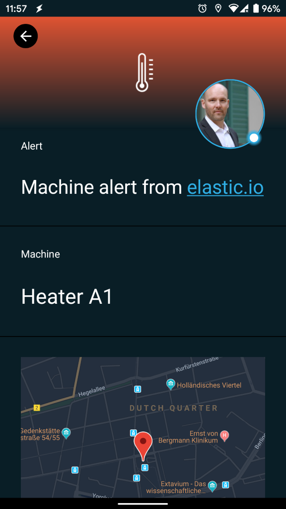
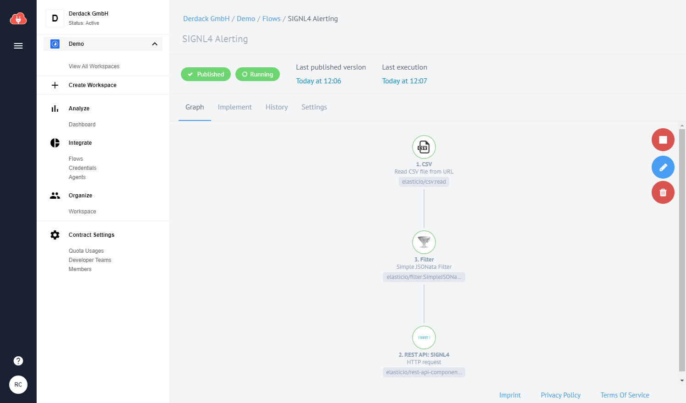
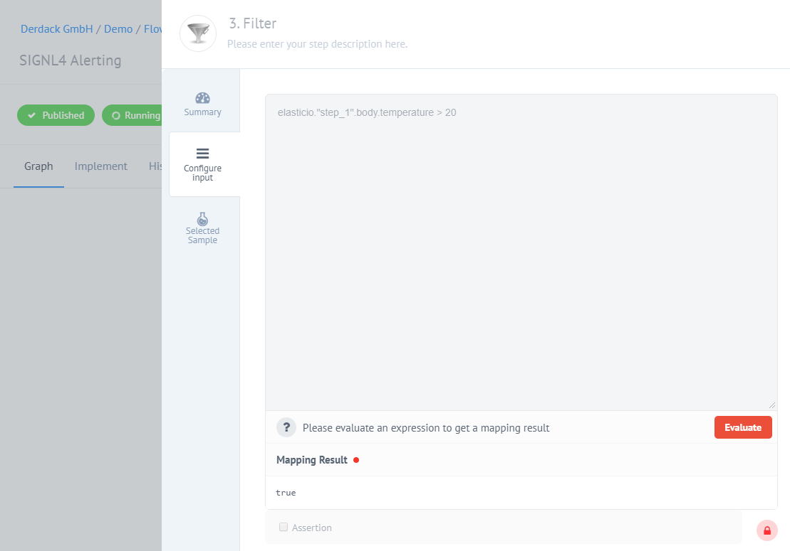

# Mobile Alarmierung per App, SMS und Anruf für elastic.io

Mobile Alarmierung mit Tracking, Bereitschafts-Planung und Eskalation für elastic.io.

## Warum SIGNL4

elastic.io ist eine hybride Integrations-Plattform, die mit einer umfangreichen Bibliothek von vorgefertigten Konnektoren für Mainstream-Geschäftsanwendungen ausgestattet ist. Es kann den eigenen Integrations-Aufwand deutlich reduzieren. Die Integration dieser leistungsstarken Plattform mit SIGNL4 kann Ihren täglichen Betrieb durch die zuverlässige Alarmierung mobiler Teams verbessern, egal wo sich diese befinden.



## So funktioniert es

Alles, was für die Verknüpfung von elastic.io mit SIGNL4 nötig ist, ist eine REST API Aktion in Ihrem elastic.io Flow. Dies ermöglicht den Aufruf des SIGNL4-Webhooks und somit die Auslösung eines SIGNL4-Alarms.

## Integration

- Alarmierung von Wartungsteams in SIGNL4 per mobilem Push, Text und Sprache
- Anbindung an SIGNL4 per Email (SMTP API)
- Transparente Quittierung in der mobilen App
- Eskalation von Alarmen wenn eine bestimmte Zeit verstrichen ist
- Team-Kommunikation innerhalb von Alarmen
- Nachvollziehbarkeit der Störungs-Behebung
- Integrierte Bereitschafts-Planung, um die richtigen Personen zur richtigen Zeit zu alarmieren
- Alarmierung über kritische IoT-Status
- Mögliche Zwei-Wege-Integration zur Interaktion mit Geräten

## Szenarien

- Workflow-Automatisierung
- DevOps
- IT-Betriebsabläufe
- Service-Management
- IoT
- Produktion und Fertigung, Versorgungs-Sektor, Öl und Gas, Landwirtschaft, etc.

## Und so funktioniert es

### Integration von SIGNL4 mit elastic.io

In unserem Beispiel werden wir eine CSV-Datei von einem Web-Server lesen und die Daten als Warnung an unser SIGNL4-Team senden.

SIGNL4 ist eine mobile App mit der Teams schneller und effektiver auf kritische Alarme, technische Störungen und dringende Service-Aufträge reagieren können. Holen Sie sich die App unter https://www.signl4.com.

### Voraussetzungen

Ein SIGNL4-Konto (https://www.signl4.com)

Ein elastic.io Konto (https://app.elastic.io)

Ein Web-Server für das Test-Szenario (optional)


#### Integrations-Schritte

1. Logon auf elastic.io  

Loggen Sie sich in der elastic.io Plattform unter https://app.elastic.io ein und gehen Sie dann zu Flows.

2. Anlegen des Flow  

Nun können Sie einen neuen Flow anlegen, der aus drei Schritten besteht:

1. CSV Component: Diese liest in bestimmten Intervallen die CSV-Datei von einem Web-Server. Hier definieren Sie die entsprechende URL.
2. Filter: Dieser Schritt ist optional und wir überprüfen hier lediglich bestimmte Bedingungen (Temperatur zu hoch).
3. REST API: Hier senden wir den HTTP-POST-Request an SIGNL4, um den Alarm auszulösen.



3. CSV Connector  

Hier lesen wir die CSV-Datei von unserem Web-Server.


Das Format der CSV-Datei ist das folgende.

```
Machine;Location;Status;Temperature
Heater A2;52.3995023,13.0584155;OK;4
Heater A1;52.3995023,13.0584155;Error;44
```

4. Filter  

In diesem optionalen Schritt überprüfen wir, ob die Temperatur höher als ein bestimmter Wert ist. Nur in diesem Fall wird der Flow weiter ausgeführt.



5. Konfigurieren des HTTP Requests  

Wir senden einen HTTP-Push-Request an SIGNL4, um einen Alarm auszulösen. Die URL ist Ihre SIGNL4-Web-Hook-URL einschließlich Ihres Team-Geheimnisses. Der content-type ist application/json und der Body ist der JSON-Payload. In unserem Fall übernehmen wir den Inhalt der CSV-Datei von unserem Web-Server.


6. Testen Sie es  

Um den Flow zu testen können Sie eine CSV-Datei mit obigem Inhalt auf Ihren Web-Server legen. Der Flow sendet dann den Inhalt an SIGNL4. Ihr SIGNL4-Team wird den Alarm erhalten.

Ein Beispiel finden Sie auf in GitHub:
https://github.com/signl4/signl4-integration-elastic.io
