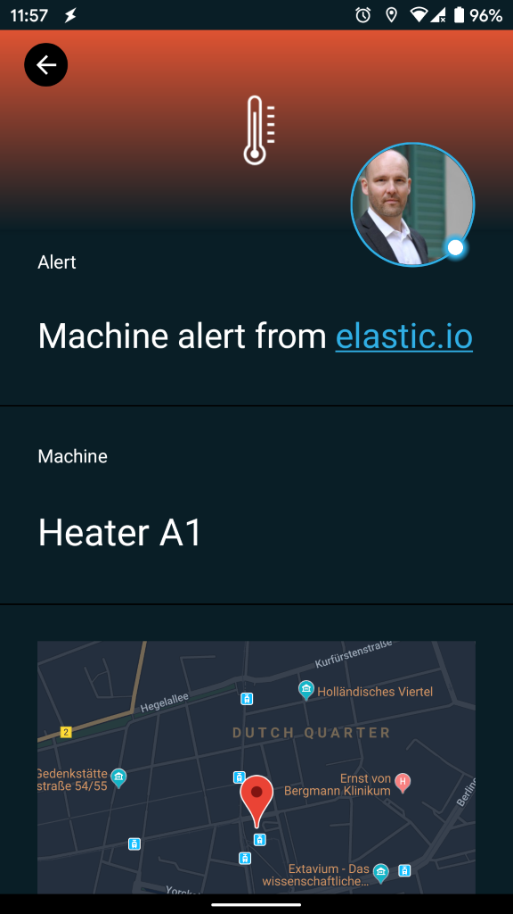
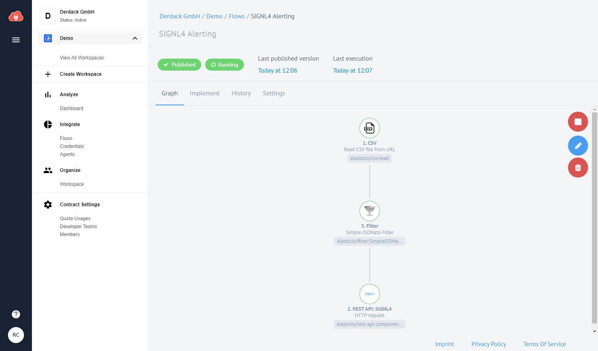
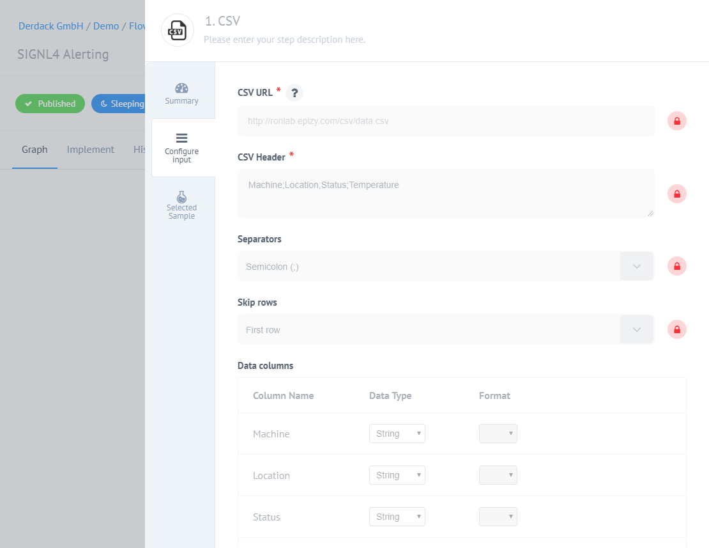
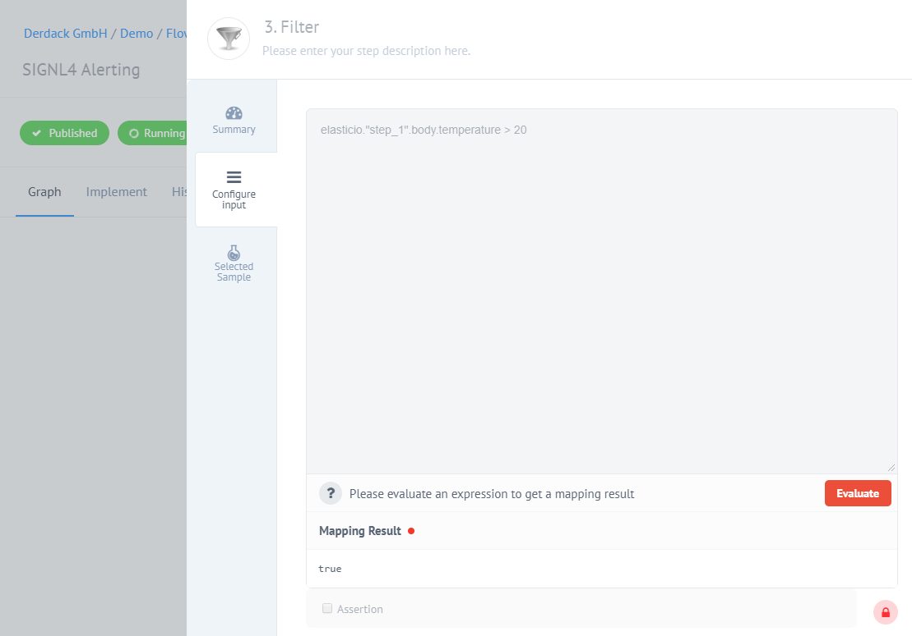
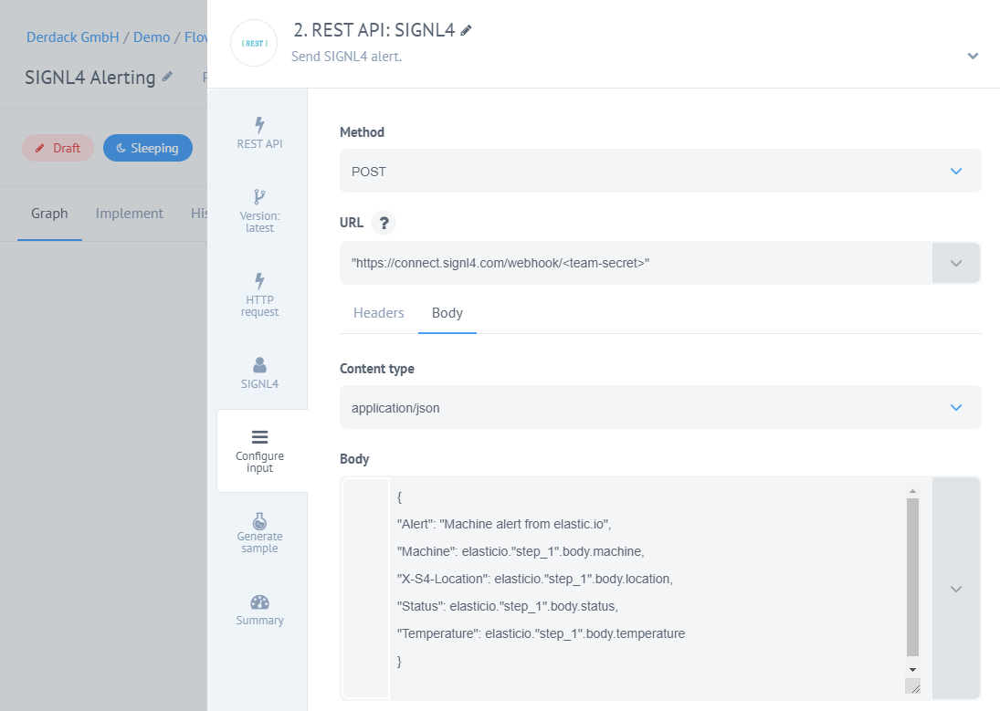

# Mobile alerting with tracking & escalation for elastic.io

Mobile alerting with tracking, duty planning and escalation for elastic.io.

## Why SIGNL4

elastic.io is a hybrid integration platform that comes with a rich library of pre-built connectors for mainstream business applications. It can reduce your own integration efforts significantly. Pairing this powerful platform with SIGNL4 can enhance your daily operations with an extension to your team wherever it is.



## How it Works

All it takes to pair elastic.io and SIGNL4 is a REST API action in your elastic.io flow. This allows to call the SIGNL4 webhook and to trigger an according alert.

## Integration Capabilities

- Service engineers alerted via mobile push, text and voice
- Integration with SIGNL4 via webhook or email (SMTP)
- Staff can acknowledge and take ownership for critical events that occur
- Alerts are escalated in case of no response
- Communicate within an alert to address a particular problem
- Tracking and visibility of problem solutions
- Integrated on-call duty planning
- Alert on critical IoT device states
- Two-way integration to interact or set the device state

## Scenarios

- Workflow automation
- DevOps
- IT operations
- Service Management
- IoT
- IT, Manufacturing, Utility, Oil and Gas, Agriculture, etc.

## How To Integrate

### Integrating SIGNL4 with elastic.io

In our example we will read a .csv file from a web server and send the data as an alert to our SIGNL4 team.

SIGNL4 is a mobile alert notification app for powerful alerting, alert management and mobile assignment of work items. Get the app at https://www.signl4.com.

### Prerequisites

A SIGNL4 (https://www.signl4.com) account

An elastic.io (https://app.elastic.io) account

An web server for testing (optional)

#### Integration Steps

1. Logon to elastic.io  

Log on to the elastic.io platform at https://app.elastic.io and go to Flows.

2. Create the Flow  

Now you can create a new flow consisting of three steps:

1. CSV Connector: Reads the .csv file from a web server in certain intervals. You define your URL here.
2. Filter: This is optional and we just check for certain conditions (temperature too high) here.
3. REST API: Here we send the HTTP POST request to SIGNL4 in order to trigger the alert.



3. CSV Connector  

Here we read a .csv file from a web server.



The format of our .csv file is the following.

```
Machine;Location;Status;Temperature
Heater A2;52.3995023,13.0584155;OK;4
Heater A1;52.3995023,13.0584155;Error;44
```

4. Filter  

In this optional step we check is the temperature is higher than a certain value. Only in this case the flow will continue.



5. Configure the REST API  

We send an HTTP Push request to SIGNL4 in order to trigger an alert. The URL is your SIGNL4 webhook URL including your team secret. The content-type is application/json and the Body is the JSON payload. In our case we take the content of the .csv file from our web server.



6. Test It  

For testing you can create a .csv file with the above content and put it onto your web server. Then the Flow will read the file and send the content to SIGNL4. Your SIGNL4 team will get the alert.

You can find a sample in GitHub:
https://github.com/signl4/signl4-integration-elastic-io
